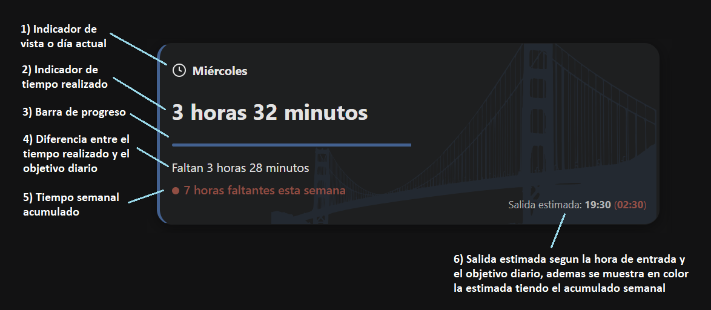
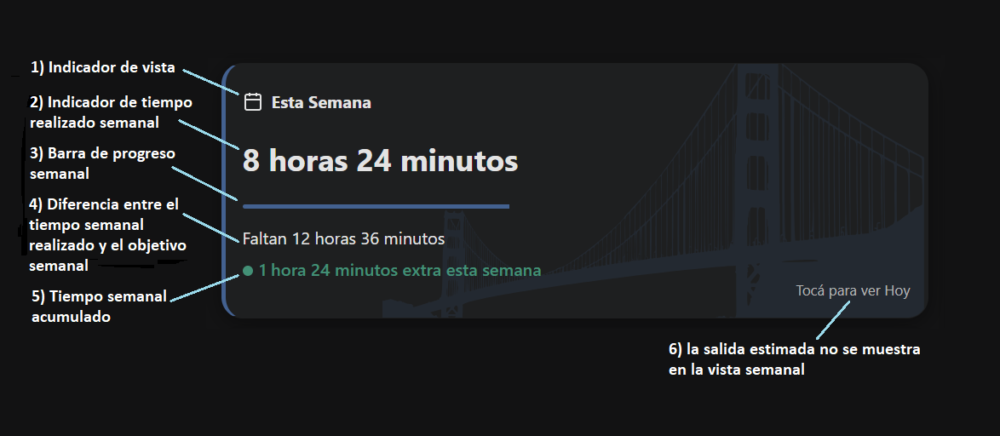
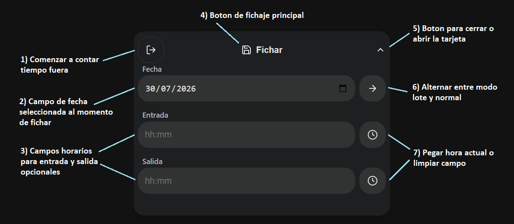
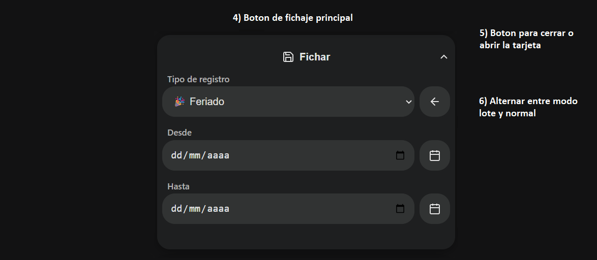

# Horarios

## ✨ Características

* **Registro de jornadas:** Carga de jornadas laborales y días especiales (feriados, vacaciones, licencias).
* **Configuración de objetivos:** Definición de horas diarias objetivo (global o individual) y días laborales por semana.
* **Control en tiempo real:** Visualización del tiempo transcurrido, tiempo restante y saldo semanal.
* **Métricas y estadísticas:** Análisis detallado semanal, mensual y anual en base a los registros.
* **Informes detallados:** Generación de reportes mensuales y anuales.
* **Historial y vistas:** Consulta de registros históricos mediante lista o vista de calendario.
* **Múltiples perfiles:** Gestión de distintos perfiles (personales o laborales).
* **Copias de seguridad:** Creación de backups locales y sincronización en la nube mediante GitHub Gist.

### 🟢 Tarjeta de Estado (vista diaria)

### 🟢 Tarjeta de Estado (vista semanal)

### ⏱️ Tarjeta de Fichaje (modo normal)

### ⏱️ Tarjeta de Fichaje (modo lote)

